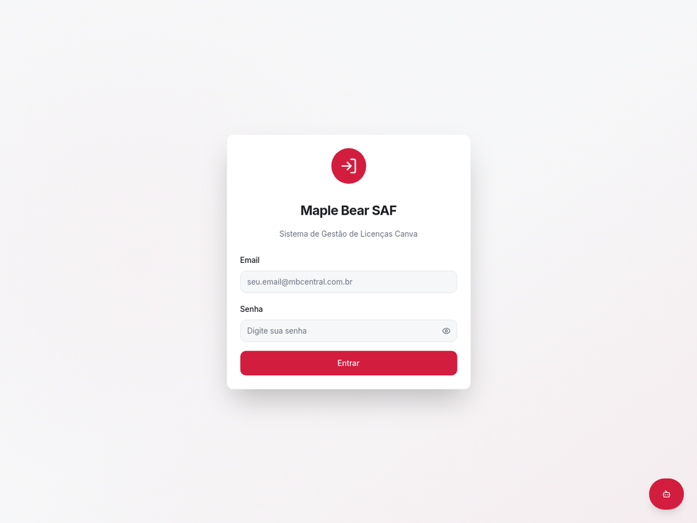

# 🚀 Início Rápido - MapleBear SAF

## ⚡ Executar em 3 Passos

### 1. Navegar até o diretório
```bash
cd /home/ubuntu/safmaplebear
```

### 2. Iniciar o servidor (escolha uma opção)

**Opção A - Script automático:**
```bash
./start-dev.sh
```

**Opção B - Comando direto:**
```bash
npm run dev
```

### 3. Acessar a aplicação
Abra seu navegador em: **http://localhost:3000**

---

## 📸 Prévia

A aplicação estará rodando com a tela de login:



---

## 🎯 Funcionalidades Principais

- ✅ **Sistema de Login** - Autenticação de usuários
- ✅ **Dashboard** - Visão geral do sistema
- ✅ **Gestão de Licenças Canva** - Atribuir, revogar, transferir
- ✅ **Gestão de Escolas** - Cadastro e gerenciamento
- ✅ **Sistema de Vouchers** - Controle de vouchers
- ✅ **Analytics** - Insights e relatórios
- ✅ **Sistema de Tickets** - Suporte e atendimento
- ✅ **Assistente AI** - Chatbot integrado

---

## 🔧 Comandos Úteis

```bash
# Desenvolvimento
npm run dev

# Build de produção
npm run build

# Preview do build
npm run preview

# Verificar tipos TypeScript
npm run type-check

# Parar servidor (se necessário)
lsof -ti:3000 | xargs kill -9
```

---

## 📚 Documentação Completa

Para informações detalhadas, consulte:

- **[AMBIENTE_LOCAL.md](AMBIENTE_LOCAL.md)** - Guia completo de configuração
- **[ALTERACOES_REALIZADAS.md](ALTERACOES_REALIZADAS.md)** - Log de alterações

---

## ✨ Status

**✅ Ambiente configurado e funcionando!**

- Frontend: React 19 + TypeScript + Vite
- UI: shadcn/ui + Tailwind CSS
- Roteamento: React Router DOM
- Estado: TanStack Query + Zustand
- Porta: 3000
- Hot Reload: Ativado

---

## 🆘 Problemas?

### Porta já em uso
```bash
lsof -ti:3000 | xargs kill -9
```

### Reinstalar dependências
```bash
rm -rf node_modules package-lock.json
npm install --legacy-peer-deps
```

### Ver logs do servidor
Os logs aparecem automaticamente no terminal onde você executou `npm run dev`

---

**Pronto para começar! 🎉**
